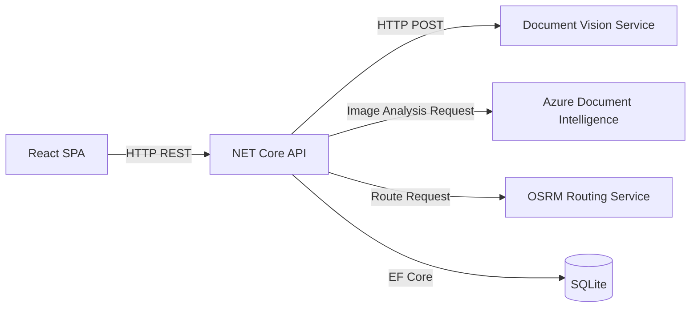
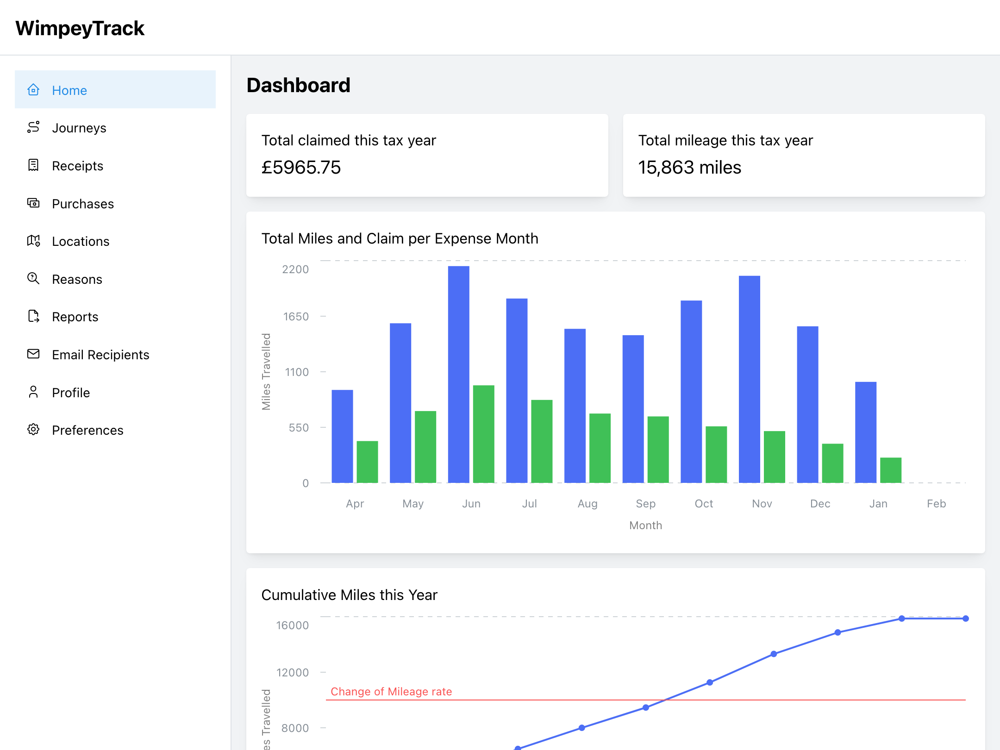
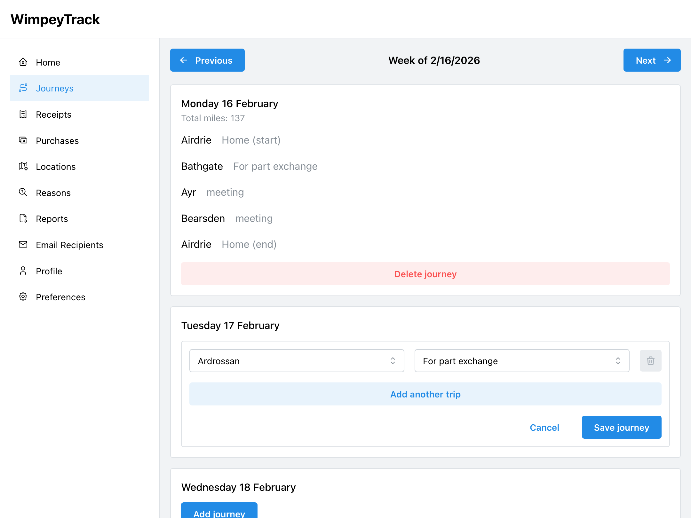
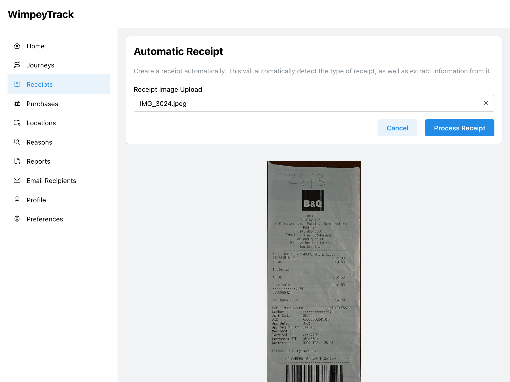
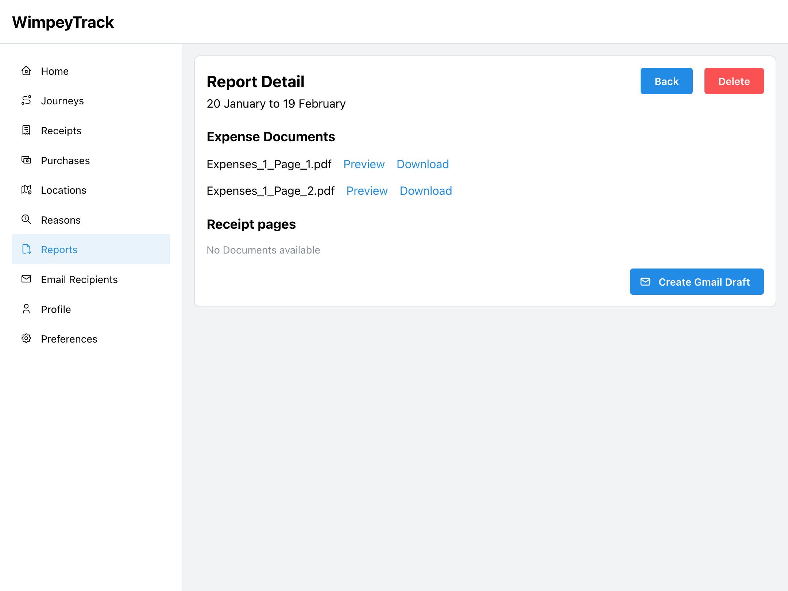

# WimpeyTrack
## Overview
> A responsive web application to simplify the input of the users expense information into a single system. 
> The grouped information can then be sent to recipients for approval through Gmail or downloaded.

### Features
- Convenient trip logging with automatic distance calculation with routing engine.
- Receipt Analysis to extract purchase information.
- Simple receipt detection to crop the image to the content only.
- Automatic claim rate calculate for the tax year.

## Architecture

## Demonstration
### Dashboard

### Journey entry

### Receipt OCR entry

### Report generation

